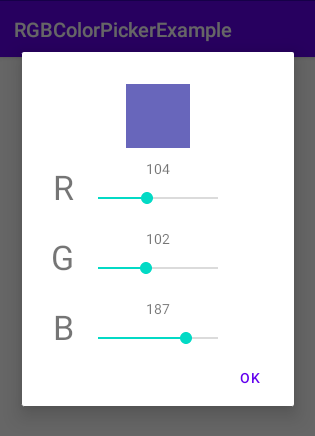

# rgbColorPickerDialog
Yet another simple color picker dialog

## Screen shot


## Usage
Add it to your build.gradle with:
```gradle
allprojects {
    repositories {
        maven { url "https://jitpack.io" }
    }
}
```
and:
```gradle
dependencies {
    implementation 'com.github.twobartha:rgbColorPickerDialog:{latest version}'
}
```

Use like this:

```kotlin
    val dialog = RGBColorPickerDialog.create(255, 0, 0)
    // val dialog = RGBColorPickerDialog.create(255, 0, 0, 255)         // Use this if you want to use alpha
    // val dialog = RGBColorPickerDialog.createWithHSV(255, 0, 0)       // Use this to show SeekBars for HSV
    // val dialog = RGBColorPickerDialog.createWithHSV(255, 0, 0, 255)  //  and to use alpha

    val listener: RGBColorPickerDialog.Listener = object : RGBColorPickerDialog.Listener {
        override fun onFinished(r: Int, g: Int, b: Int, a: Int) {
            // TODO: use values
        }
    }

    dialog.setOnFinishedListener(listener)
    dialog.show(supportFragmentManager, "dialog")
```
